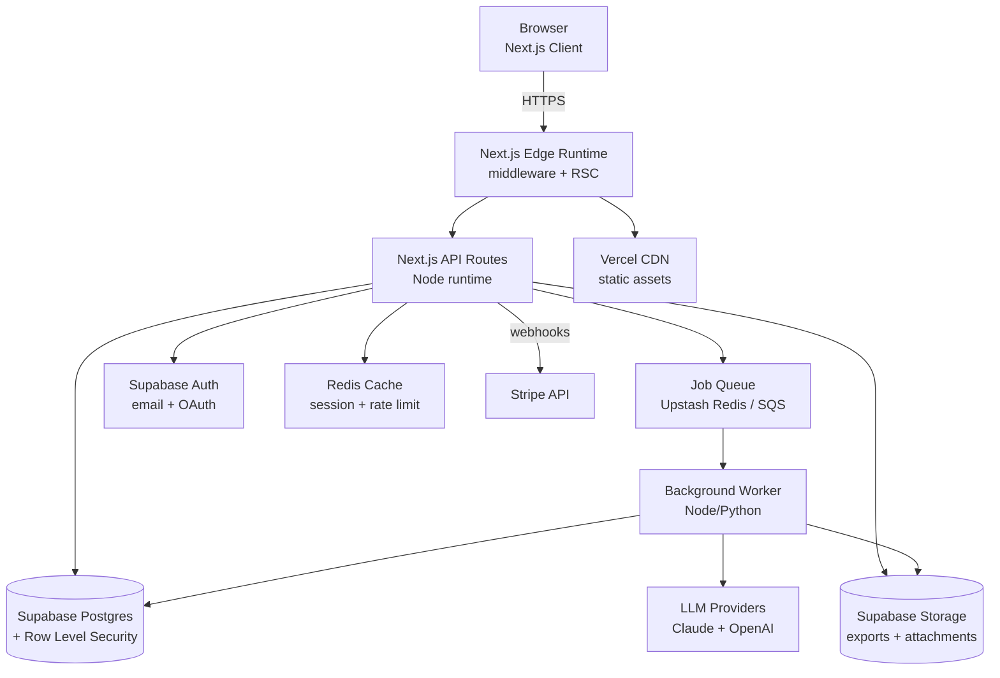

# 02 — High-Level Architecture

```mermaid
flowchart TB
  Client[Browser<br/>Next.js Client]
  Edge[Next.js Edge Runtime<br/>middleware + RSC]
  API[Next.js API Routes<br/>Node runtime]
  Queue[Job Queue<br/>Upstash Redis / SQS]
  Worker[Background Worker<br/>Node/Python]
  DB[(Supabase Postgres<br/>+ Row Level Security)]
  Storage[(Supabase Storage<br/>exports + attachments)]
  Auth[Supabase Auth<br/>email + OAuth]
  Cache[Redis Cache<br/>session + rate limit]
  Stripe[Stripe API]
  LLM[LLM Providers<br/>Claude + OpenAI]
  CDN[Vercel CDN<br/>static assets]

  Client -->|HTTPS| Edge
  Edge --> CDN
  Edge --> API
  API --> Cache
  API --> Auth
  API --> DB
  API --> Queue
  API --> Storage
  API -->|webhooks| Stripe
  Queue --> Worker
  Worker --> LLM
  Worker --> DB
  Worker --> Storage
```
