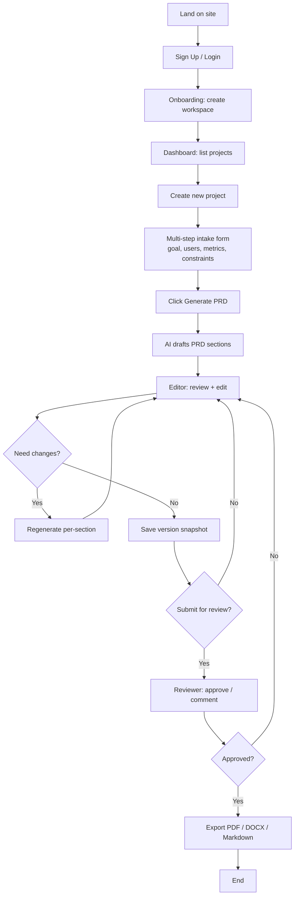

# 03 — User Flow

```mermaid
flowchart TD
  A[Land on site] --> B[Sign Up / Login]
  B --> C[Onboarding: create workspace]
  C --> D[Dashboard: list projects]
  D --> E[Create new project]
  E --> F[Multi-step intake form<br/>goal, users, metrics, constraints]
  F --> G[Click Generate PRD]
  G --> H[AI drafts PRD sections]
  H --> I[Editor: review + edit]
  I --> J{Need changes?}
  J -->|Yes| K[Regenerate per-section]
  K --> I
  J -->|No| L[Save version snapshot]
  L --> M{Submit for review?}
  M -->|No| I
  M -->|Yes| N[Reviewer: approve / comment]
  N --> O{Approved?}
  O -->|No| I
  O -->|Yes| P[Export PDF / DOCX / Markdown]
  P --> Q[End]
```
