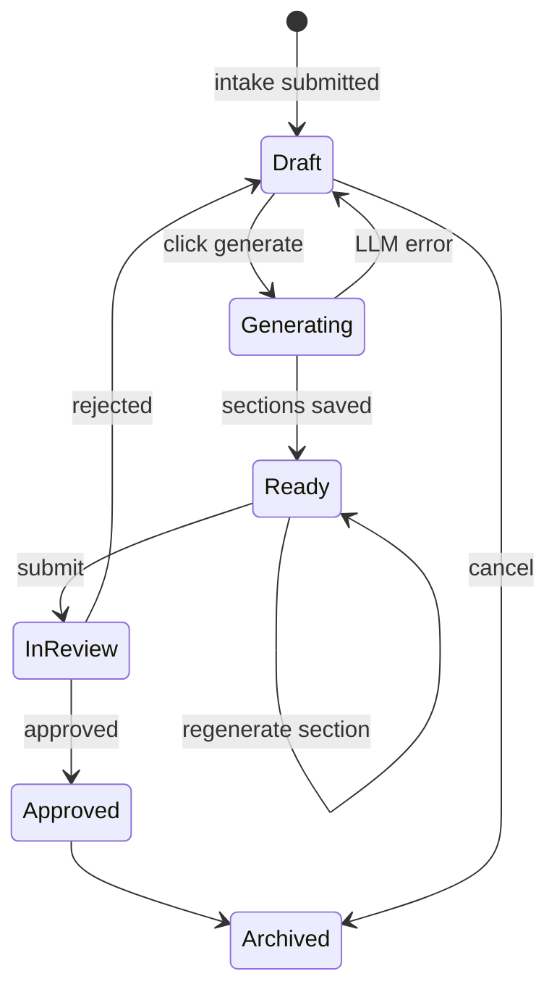

# 04 — PRD Lifecycle (State Machine)

```mermaid
stateDiagram-v2
  [*] --> Draft : intake submitted
  Draft --> Generating : click generate
  Generating --> Draft : LLM error
  Generating --> Ready : sections saved
  Ready --> InReview : submit
  InReview --> Draft : rejected
  InReview --> Approved : approved
  Approved --> Archived
  Draft --> Archived : cancel
  Ready --> Ready : edit + autosave
  Ready --> Ready : regenerate section
```
