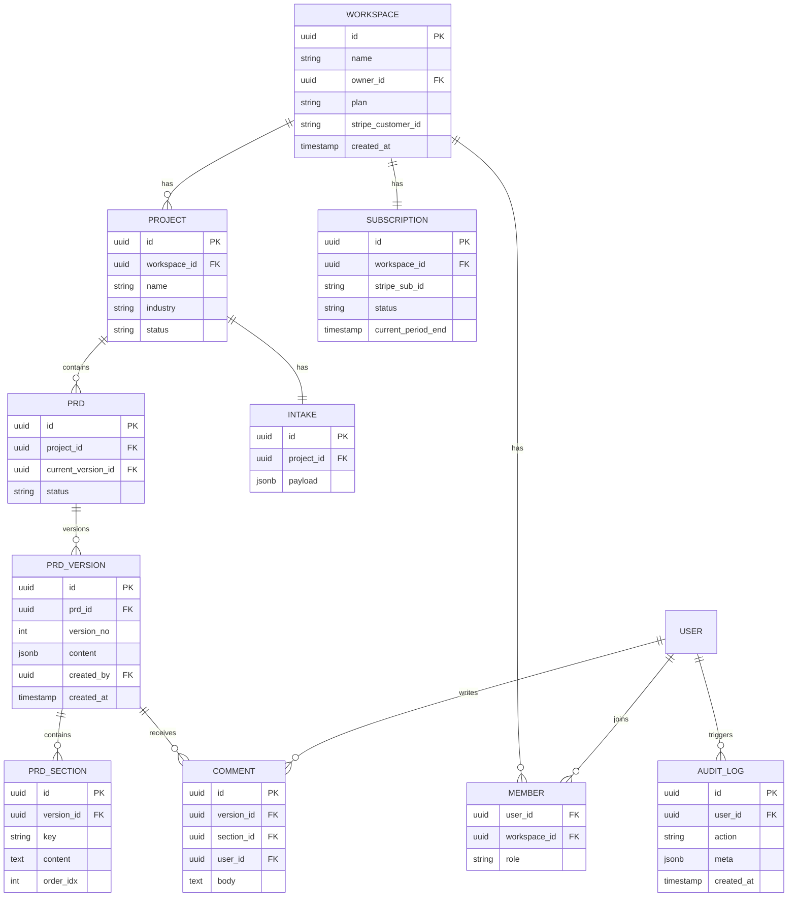

# 05 — Data Model (ERD)

## Notes
- **RLS (Row Level Security)** enabled on every table; policy = `workspace_id = auth.jwt()->>'workspace_id'`.
- `prd_versions.content` is a `jsonb` snapshot — enables diff & rollback without parsing Tiptap JSON.
- `audit_log` is append-only (no UPDATE/DELETE policy) for compliance.
- Indexes: `prds(project_id)`, `prd_versions(prd_id, version_no DESC)`, `comments(version_id)`, `subscriptions(stripe_sub_id)`.
