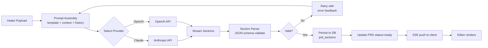

# 06 — AI Generation Pipeline

## Prompt Strategy
- One prompt per **section** (not whole PRD) → smaller context, lower cost, easier regenerate.
- Section keys: `problem`, `goals`, `users`, `success_metrics`, `requirements`, `out_of_scope`, `timeline`, `risks`.
- System prompt is static + workspace-level "voice" override.
- Temperature: `0.4` for generation, `0.2` for refinement.
