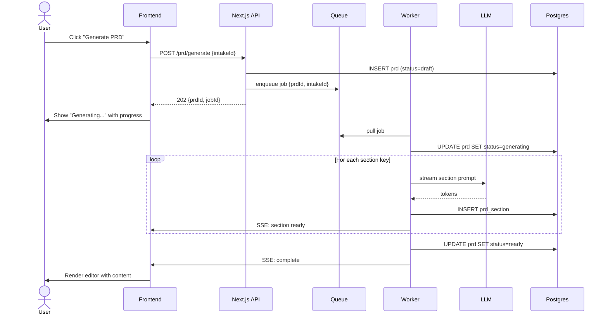

# 07 — Sequence: Generate PRD

```mermaid
sequenceDiagram
  actor U as User
  participant FE as Frontend
  participant API as Next.js API
  participant Q as Queue
  participant W as Worker
  participant L as LLM
  participant DB as Postgres

  U->>FE: Click "Generate PRD"
  FE->>API: POST /prd/generate {intakeId}
  API->>DB: INSERT prd (status=draft)
  API->>Q: enqueue job {prdId, intakeId}
  API-->>FE: 202 {prdId, jobId}
  FE->>U: Show "Generating..." with progress

  W->>Q: pull job
  W->>DB: UPDATE prd SET status=generating
  loop For each section key
    W->>L: stream section prompt
    L-->>W: tokens
    W->>DB: INSERT prd_section
    W->>FE: SSE: section ready
  end
  W->>DB: UPDATE prd SET status=ready
  W->>FE: SSE: complete
  FE->>U: Render editor with content
```
