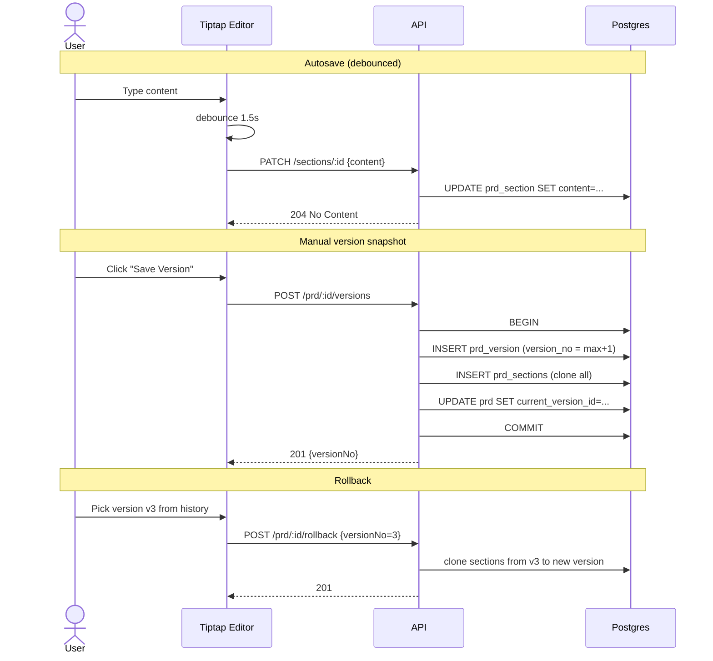

# 08 — Sequence: Edit + Autosave + Version

```mermaid
sequenceDiagram
  actor U as User
  participant FE as Tiptap Editor
  participant API as API
  participant DB as Postgres

  Note over U,DB: Autosave (debounced)
  U->>FE: Type content
  FE->>FE: debounce 1.5s
  FE->>API: PATCH /sections/:id {content}
  API->>DB: UPDATE prd_section SET content=...
  API-->>FE: 204 No Content

  Note over U,DB: Manual version snapshot
  U->>FE: Click "Save Version"
  FE->>API: POST /prd/:id/versions
  API->>DB: BEGIN
  API->>DB: INSERT prd_version (version_no = max+1)
  API->>DB: INSERT prd_sections (clone all)
  API->>DB: UPDATE prd SET current_version_id=...
  API->>DB: COMMIT
  API-->>FE: 201 {versionNo}

  Note over U,DB: Rollback
  U->>FE: Pick version v3 from history
  FE->>API: POST /prd/:id/rollback {versionNo=3}
  API->>DB: clone sections from v3 to new version
  API-->>FE: 201
```
