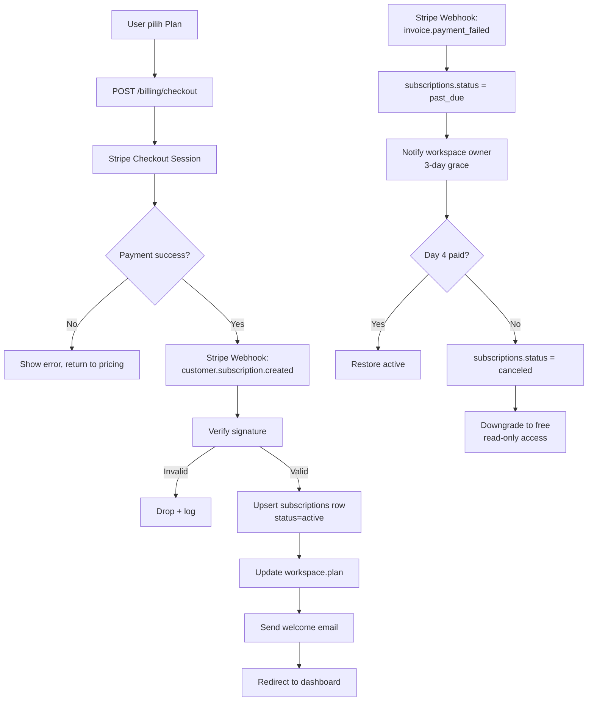

# 09 — Billing Flow (Stripe Subscription)

## Seat Enforcement
- Each `MEMBER` row counts as 1 seat.
- On `member.created` event: if `count(workspace.seats) > workspace.plan.max_seats` → reject with 402.
- Webhook `customer.subscription.updated` re-syncs `plan.max_seats`.
