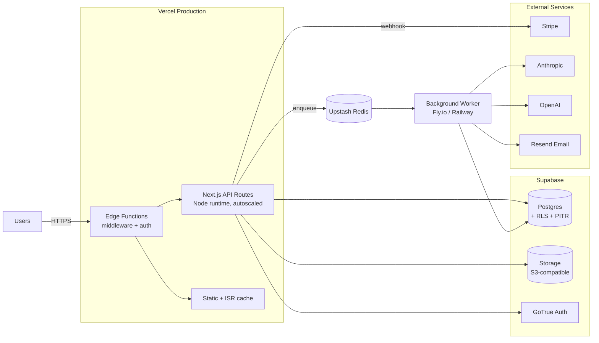

# 10 — Deployment Topology

```mermaid
flowchart LR
  subgraph Vercel[Vercel Production]
    Edge[Edge Functions<br/>middleware + auth]
    NextAPI[Next.js API Routes<br/>Node runtime, autoscaled]
    CDN[Static + ISR cache]
  end

  subgraph Supabase[Supabase]
    PG[(Postgres<br/>+ RLS + PITR)]
    S3[(Storage<br/>S3-compatible)]
    GoTrue[GoTrue Auth]
  end

  subgraph External[External Services]
    Stripe
    Anthropic
    OpenAI
    Resend[Resend Email]
  end

  User[Users] -->|HTTPS| Edge
  Edge --> CDN
  Edge --> NextAPI
  NextAPI --> PG
  NextAPI --> S3
  NextAPI --> GoTrue
  NextAPI -->|webhook| Stripe
  NextAPI -->|enqueue| Queue[(Upstash Redis)]
  Queue --> Worker[Background Worker<br/>Fly.io / Railway]
  Worker --> Anthropic
  Worker --> OpenAI
  Worker --> PG
  Worker --> Resend
```
