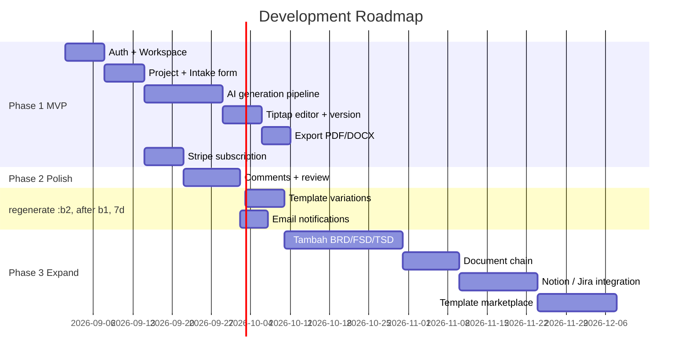

# 11 — Development Roadmap

```mermaid
gantt
  title Development Roadmap
  dateFormat YYYY-MM-DD
  section Phase 1 MVP
  Auth + Workspace          :a1, 2026-09-01, 7d
  Project + Intake form     :a2, after a1, 7d
  AI generation pipeline    :a3, after a2, 14d
  Tiptap editor + version   :a4, after a3, 7d
  Export PDF/DOCX           :a5, after a4, 5d
  Stripe subscription       :a6, after a2, 7d
  section Phase 2 Polish
  Comments + review         :b1, after a6, 10d
  Section regenerate        :b2, after b1, 7d
  Template variations       :b3, after b2, 7d
  Email notifications       :b4, after b1, 5d
  section Phase 3 Expand
  Tambah BRD/FSD/TSD        :c1, after b3, 21d
  Document chain            :c2, after c1, 10d
  Notion / Jira integration :c3, after c2, 14d
  Template marketplace      :c4, after c3, 14d
```
