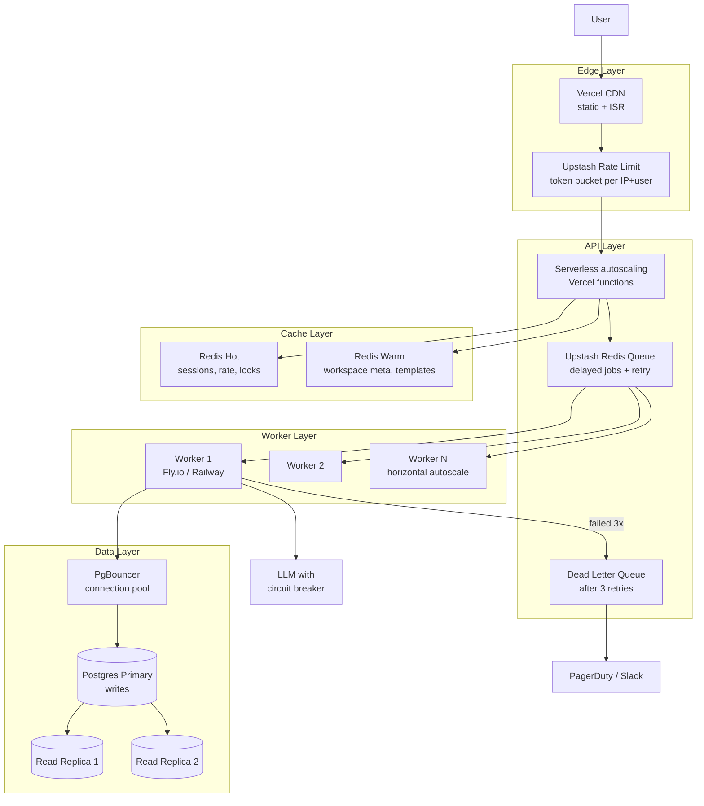

# 12 — Scaling Strategy (High Traffic)

## Bottlenecks & Mitigations

| Bottleneck | Symptom | Mitigation |
|---|---|---|
| LLM rate limit | 429 from Anthropic/OpenAI | Provider-level queue + per-key concurrency cap; user-facing backoff with exponential retry |
| Postgres connections | `too many connections` | PgBouncer pool, max 100 conn/function instance |
| Editor concurrent edit | Lost writes | Postgres advisory lock per `prd_version` + last-write-wins on section |
| Export job slow | PDF gen > 30s | Move to worker, stream result via SSE + signed URL |
| Stripe webhook spike | Race conditions | Idempotency key = `event.id`, dedupe table |
| Cold start | Latency spike | Vercel Fluid Compute / keep-warm ping every 4 min |

## Cost Ceilings (rule of thumb)
- **< 1k users**: free tier semua service di atas cukup.
- **1k–10k users**: tambah 1 Postgres read replica, naikin worker ke 2 instance.
- **10k+ users**: pindah queue ke AWS SQS, Postgres ke Aurora, pertimbangkan multi-region.
