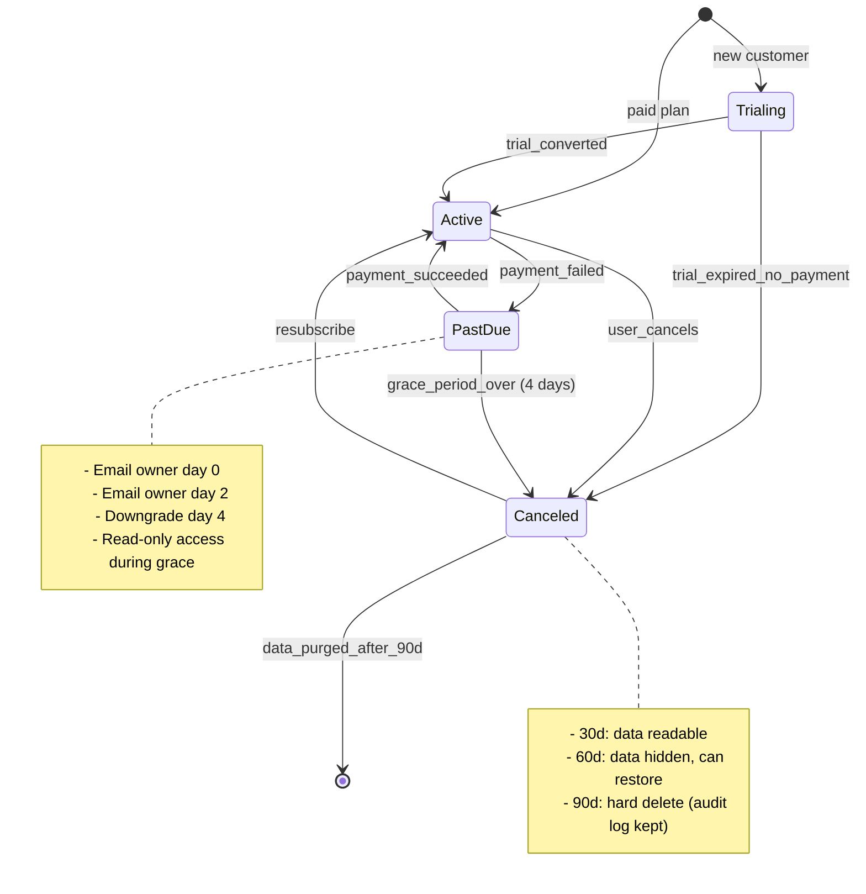

# 13 — Subscription State Machine & Edge Cases

## Plan Tiers

| Plan | Seats | PRDs/mo | Price | Quota enforcement |
|---|---|---|---|---|
| Free | 1 | 3 | $0 | Hard cap at 3 active PRDs |
| Pro | 5 | 50 | $29/seat | Soft warn at 80% |
| Team | 20 | 250 | $19/seat | Soft warn at 80% |
| Enterprise | unlimited | unlimited | custom | Custom contract |

## Edge Cases to Handle

1. **Upgrade mid-cycle** → prorate immediately, unlock new tier, no double charge.
2. **Downgrade mid-cycle** → take effect at `current_period_end`, no refund (Stripe default).
3. **Add seat beyond plan** → block at `/member` create with 402 + upgrade CTA.
4. **Webhook out-of-order** → use `event.created` timestamp, not webhook arrival order.
5. **Card declined retry** → Stripe Smart Retries (built-in) + our 3-day grace.
6. **Trial abuse** → 1 trial per `stripe_customer_id`, not per email.
7. **Subscription paused** (Stripe feature) → treat as `past_due` for product access.
8. **Tax** → enable Stripe Tax for EU/US sales tax from day 1.
9. **Failed payment after 4 days** → downgrade but **keep audit_log** forever.
10. **Resubscribe after purge** → new workspace, no data recovery (warn at cancel step).
